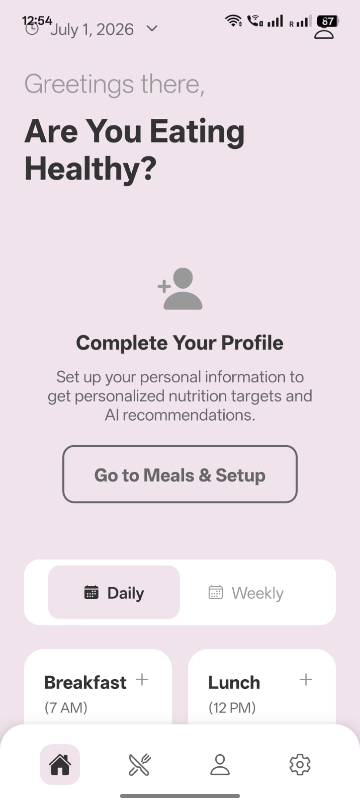
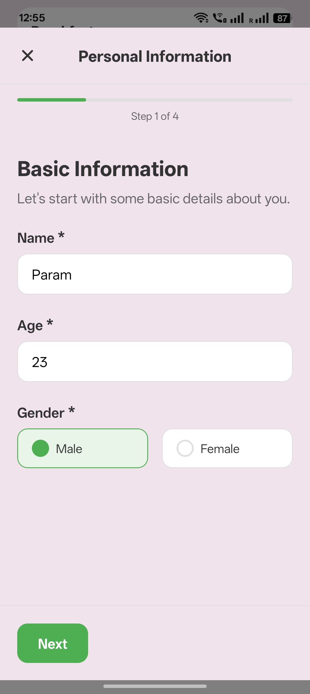
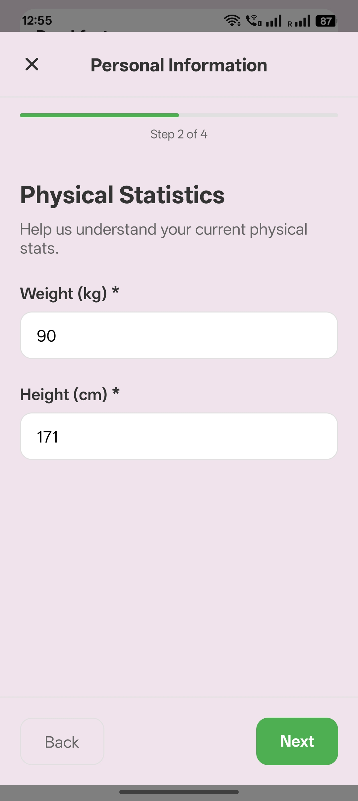
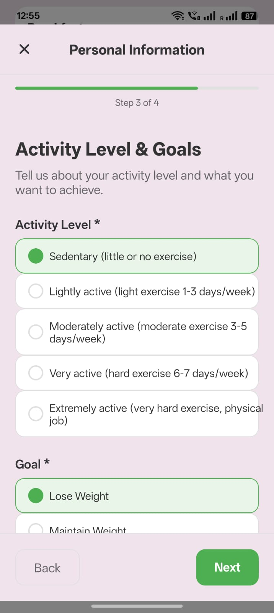
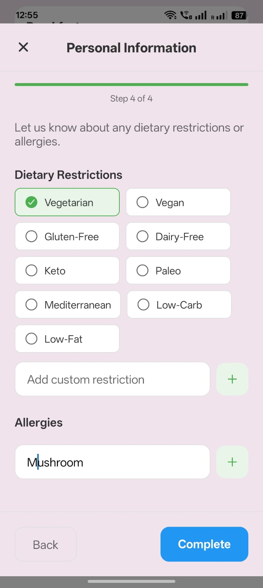
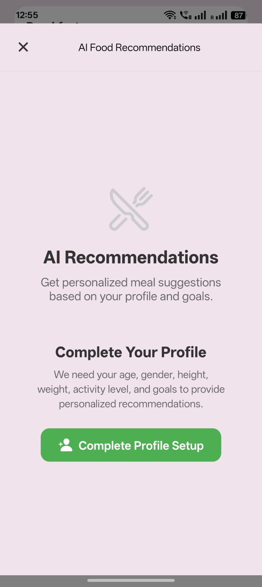
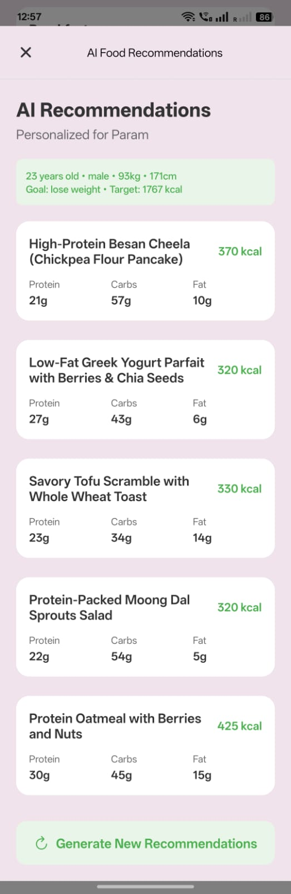
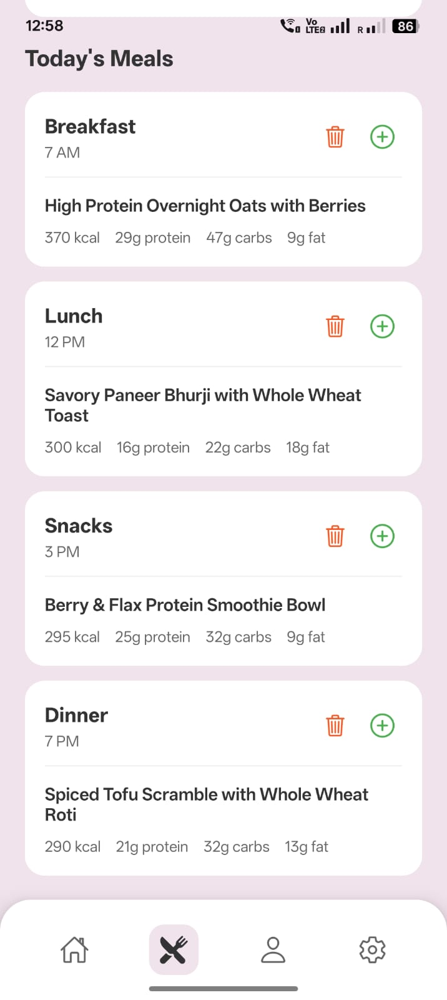
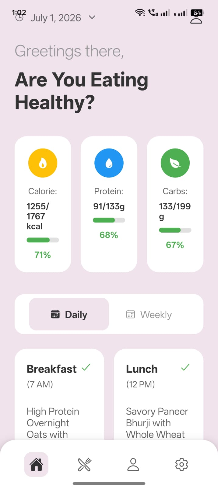

# 🥗 AI Diet Planner

An AI-powered cross-platform mobile application built using **React Native (Expo)** that helps users manage their daily nutrition, calculate calorie requirements, and receive personalized meal recommendations using **Google Gemini AI**.

---

## 📱 Screenshots

### Home Dashboard


### Profile Setup
| Step 1 | Step 2 |
|---------|---------|
|  |  |

| Step 3 | Step 4 |
|---------|---------|
|  |  |

### AI Recommendations

Before Profile Completion



After Profile Completion



### Meal Planner



### Final Home Page



---

# ✨ Features

- AI-powered meal recommendations using Google Gemini
- Personalized calorie target calculation
- Multi-step user profile onboarding
- Daily nutrition tracking
- Meal planning
- Protein, Carbs & Calories tracking
- Dietary restriction support
- Allergy management
- User profile dashboard
- Local data persistence
- Clean modern UI
- Cross-platform (Android & iOS)

---

# 🛠 Tech Stack

- React Native
- Expo SDK 53
- TypeScript
- Expo Router
- Google Gemini API
- Expo Secure Store
- React Navigation
- React Native Chart Kit

---

# 📂 Project Structure

```
app/
components/
services/
hooks/
assets/
utils/
```

---

# 🚀 Installation

Clone the repository

```bash
git clone https://github.com/yourusername/AI-Diet-Planner.git
```

Move into project

```bash
cd AI-Diet-Planner
```

Install dependencies

```bash
npm install
```

Start Expo

```bash
npx expo start
```

Scan the QR code using Expo Go.

---

# 🔑 Gemini API Setup

1. Open Google AI Studio

2. Generate a Gemini API Key

3. Open the app

Settings → API Key

Paste your key and save.

---

# 📊 App Flow

```
Profile Setup
        ↓
Calorie Calculation
        ↓
Meal Planning
        ↓
Nutrition Tracking
        ↓
AI Meal Recommendation
```

---

# 📌 Future Improvements

- Authentication
- Cloud Sync
- Barcode Food Scanner
- Workout Recommendation
- Water Intake Tracker
- Push Notifications
- Dark Mode
- Health Connect Integration

---

# 👨‍💻 Developed By

**Param Pandya**

pandyaparam7@gmail.com

M.Tech Computer Science & Engineering

AI • Machine Learning • React Native

---

## ⭐ If you like this project, consider giving it a star.